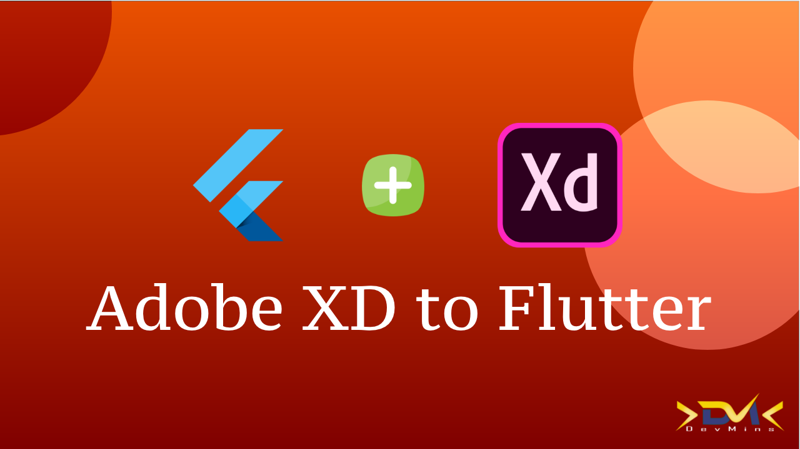

# adobe_xd_to_flutter_code

📁📁 Adobe XD Design to Flutter Code

In this video, we will be talking about a plugin in Adobe Xd that generated Flutter code.

Medium Blog -- https://medium.com/devmins/adobe-xd-design-to-flutter-code-flutter-fc41b0d9d41f

Youtube video Link

✨ Requirements
- Any Operating System (ie. MacOS X, Windows) which supports Adobe Xd
- A little knowledge of Dart and Flutter
- Any IDE with Flutter SDK installed (ie. IntelliJ, VSCode, etc)
- Adobe XD installed

Subscribe to the channel if you like what you see😉.

Follow me:
Twitter: https://twitter.com/imRaviSSingh
Facebook: https://www.facebook.com/itsravishank...
Instagram: https://www.instagram.com/itsravishan...
Github: https://github.com/ravishankarsingh1996
LinkedIn: https://www.linkedin.com/in/itsravish...

#flutter #adobeXd #adobe #trending
